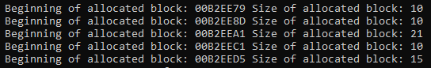
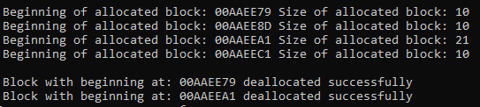

# Lab 1: General purpose memory allocator
This solution emulates general purpose memory allocator. It based on `char` array. It provides possibility to allocate and deallocate memory. 
### Block header structure:
- Status:&nbsp;&nbsp;&nbsp;&nbsp;&nbsp;&nbsp;&nbsp;&nbsp;&nbsp;&nbsp;&nbsp;&nbsp;&nbsp;&nbsp;&nbsp;&nbsp;&nbsp;&nbsp;&nbsp;&nbsp;&nbsp;&nbsp;&nbsp;&nbsp;&nbsp;&nbsp;&nbsp;&nbsp;&nbsp;&nbsp; 1 byte
- Size of previous block:&nbsp;&nbsp;&nbsp;&nbsp;&nbsp;&nbsp;4 byte
- Size of next block: &nbsp;&nbsp;&nbsp;&nbsp;&nbsp;&nbsp;&nbsp;&nbsp;&nbsp;&nbsp;&nbsp; 4 byte

### Functions:
```
void *mem_alloc(int size)
```
This function allocates a new memory block of required size. If it is possible, it returns a pointer on the beginning of allocated block. If it is not possible, then this function returns `null`.
```
void mem_free(void* addr)
```
This function is used to deallocate block of memory that is no longer needed.
```
void *mem_realloc(void* addr, int size)
```
This function is used to reallocate some block of memory if you want to decrease or increase size of it.
<br/>
<br/>
## Usage examples:
### Example 1:
Code:
```
char* tmp1 = (char*) alloc.mem_alloc(10);
char* tmp2 = (char*) alloc.mem_alloc(10);
char* tmp3 = (char*) alloc.mem_alloc(21);
char* tmp4 = (char*) alloc.mem_alloc(10);
char* tmp5 = (char*) alloc.mem_alloc(15);
```
Console output:
<br/>
<br/>

<br/>
<br/>

### Example 2:
Code:
```
char* tmp1 = (char*) alloc.mem_alloc(10);
char* tmp2 = (char*) alloc.mem_alloc(10);
char* tmp3 = (char*) alloc.mem_alloc(21);
char* tmp4 = (char*) alloc.mem_alloc(10);

alloc.mem_free(tmp1);
alloc.mem_free(tmp3);
```
Console output:
<br/>
<br/>

<br/>
<br/>

### Example 3:
Code:
```
char* tmp1 = (char*) alloc.mem_alloc(10);
char* tmp2 = (char*) alloc.mem_alloc(10);
char* tmp3 = (char*) alloc.mem_alloc(21);
char* tmp4 = (char*) alloc.mem_alloc(10);

char* tmp5 = (char*) alloc.mem_realloc(tmp1, 15);
```
Console output:
<br/>
<br/>

<br/>
<br/>
