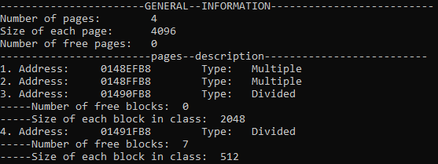
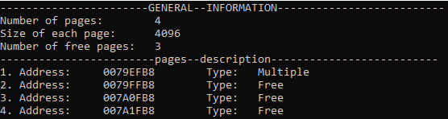

# Lab 2: General purpose memory allocator (Part 2)
This solution emulates general purpose memory allocator. It provides the possibility to allocate and deallocate memory.
The virtual memory in this allocator is divided into pages with a fixed size. 
Each page can be divided into blocks with a smaller size. Each block belongs to some class that defines the size of its blocks.


Page size 4 kb.
<br/>
Block size can be defined as 2^x, where (x ≥ 4)

### Functions:
```
void *mem_alloc(int size)
```
This function allocates a new memory block of required size. If it is possible, it returns a pointer on the beginning of allocated block. If it is not possible, then this function returns `null`.
```
void mem_free(void* addr)
```
This function is used to deallocate block of memory that is no longer needed.
```
void *mem_realloc(void* addr, int size)
```
This function is used to reallocate some block of memory if you want to decrease or increase size of it.
<br/>
<br/>
## Usage examples:
### Example 1:
Code:
```
PageAllocator allocator(15000);
  
void* test1 = allocator.mem_alloc(300);
void* test2 = allocator.mem_alloc(1600);
void* test3 = allocator.mem_alloc(8000);
void* test4 = allocator.mem_alloc(1600);
  
allocator.mem_dump(); 
```
Console output:
<br/>
<br/>

<br/>
<br/>

### Example 2:
Code:
```
PageAllocator allocator(15000);
  
void* test1 = allocator.mem_alloc(300);
void* test2 = allocator.mem_alloc(3000);
allocator.mem_free(test1);
  
allocator.mem_dump();
```
Console output:
<br/>
<br/>

<br/>
<br/>

### Example 3:
Code:
```
PageAllocator allocator(15000);

void* test1 = allocator.mem_alloc(300);
allocator.mem_dump();

allocator.mem_realloc(test1, 3000);
allocator.mem_dump();
```
Console output:
<br/>
<br/>

<br/>
<br/>
