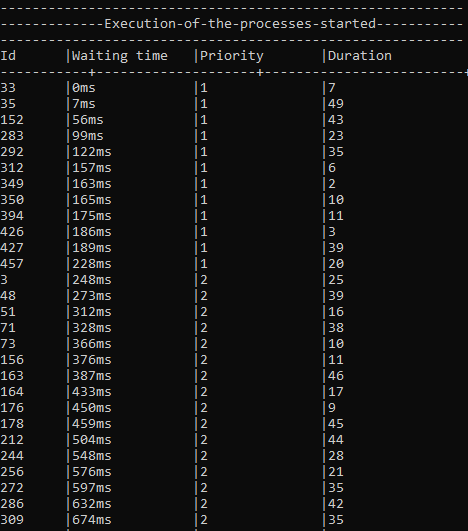
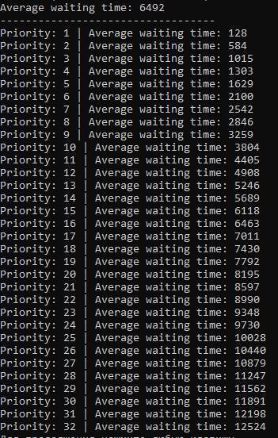
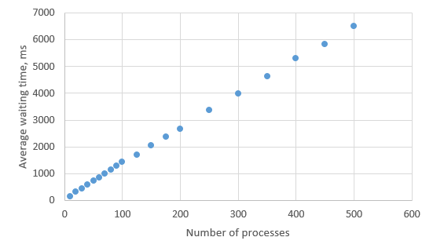
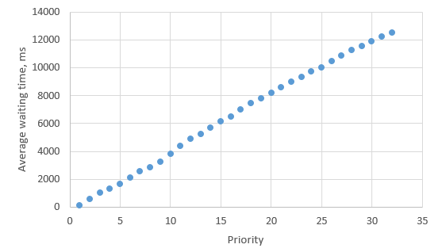

# Lab 3: Process manager based on the priority queue

This solution is a simple emulation of the process manager based on the priority queue. 
Each process has its own priority and duration. When you push a process into the process manager, the process manager put it in the position based on the process priority.
It works much better then the PM based on the simple queue, but it has some disadvantages as well. The main of them is the possibility of the low priority processes blocking.

Priority value is a number between 1 and 32 (1 is the highest priority)

## Usage examples:
### Execution of the processes

```
ProcessService processService;
std::vector<Process*> processList = generateProcesses(100);

for (Process* process : processList) {
	processService.add(process);
}

processService.start();
```

Here you can see id, priority, duration of each process and the time that each process spent in the queue.



Here you can see the average waiting time of the processes grouped by priority.



On the first graph below you can see the dependency between number of processes and the average waiting time. 
On the other graph you can see the average waiting time of the processes grouped by the priority.



