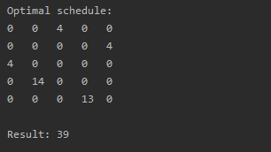

# Here you can find my implementation of the Hungarian algorithm for process scheduling.

Main steps:

1. Find the lowest number in each row and subtract it from its row.
2. Find the lowest number in each column and subtract it from its row.
3. Find a matching of the graph using cells with "0" as the graph edges. Mark found cells with "0".
4. Check whether found matching is a maximal matching If found matching is a maximal matching, then go to step 9.
5. Mark every column that contains "0" which was marked in the previous step.
6. Mark every row that contains "0" which was not marked in the previous step columns.
7. Find the lowest number that is not in the marked column or row. Subtract it from the other unmarked cells. Add it to the elements in the cells that are in the intersection of the marked rows and columns.
8. Return to step 3.
9. Return values of cells marked in step 4. 

## Usage examples:


```
int[][] matrix = {
        {32, 28, 4, 26, 4},
        {17, 19, 4, 17, 4},
        {4, 4, 5, 4, 4},
        {17, 14, 4, 14, 4},
        {21, 16, 4, 13, 4}
};

int[][] result = HungarianAlgorithm.run(matrix);

System.out.println("Optimal schedule: ");
HungarianAlgorithm.print(result);
System.out.println("Result: " + calculateResult(result));
```

Here you can see the execution result (Optimal scheduling matrix and tasks sum).


