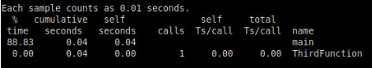

# Lab 6: Profiling

The task was to the program, optimize it and repeat profiling. Var: 13 (27 mod 15 + 1)

Since we want to profile our program with gprof, we have to provide additional parameter to the GCC command. It will look like this:

```$ gcc unoptimize.c -g -pg -o unoptimize```

After that we have to run compiled program. In our case the command will lok like this:

```$ ./unoptimize```

It will generate `gnom.out` file. 
Then we can view profiling result using command

```$ gprof unoptimized gnom.out```

Here you can see profiling result of the unoptimized program:


After optimization - deleting of the all `sleep` commands - we repeat the actions above. Here you can see profiling resutl of the optimized program:


