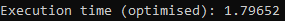

# Lab 5: Memory optimization 

The task was to optimize this block of code:

```cpp
void unoptimized() {
	int AD[2][2];
	int res = 0;

	for (int j = 500000000; j > 0; j--)
	{
		AD[0][0]++;
		AD[0][0]++;
	}

	AD[1][1] = AD[0][0];

	cout << AD[0][0];
}
```

### Optimization

- We can remove unused variable `res`.
- We can use AD[0][0]+=2 instead of duplication of AD[0][0]++. This change will decrease the number of memory calls by 2 times.

Here you can see the optimized code:

```cpp
void optimized() {
	int AD[2][2];

	for (int j = 500000000; j > 0; j--)
	{
		AD[0][0] += 2;
	}

	AD[1][1] = AD[0][0];

	cout << AD[0][0];
}
```

Here you can see time of execution of the unoptimized and the optimized code:


Unoptimized:


Optimized:


